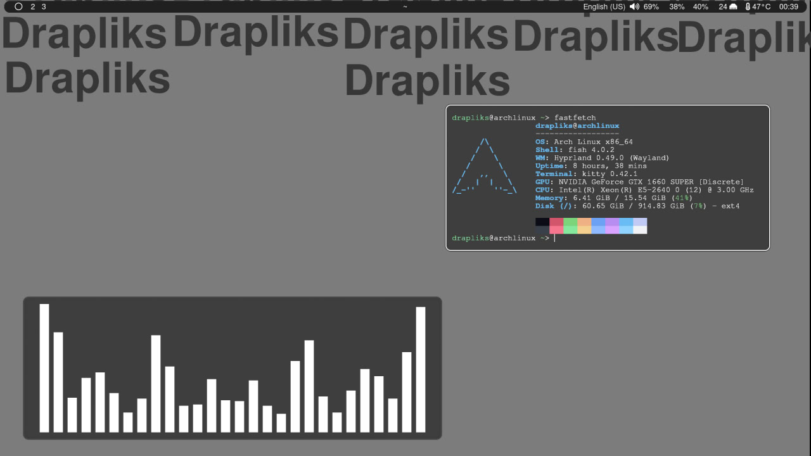

# DCHC
Drapliks Custom Hyprland Config - with beautiful design, convenient installation with all the necessary packages for Arch Linux
# Packages
```
nwg-look thunar fastfetch waybar papirus-icon-theme hyprpaper mako wl-clipboard wl-clip-persist cliphist xdg-desktop-portal-hyprland grim slurp ttf-font-awesome otf-font-awesome cava nyancat libcaca cmatrix dotnet-sdk obs-studio spotify-launcher adobe-source-han-sans-jp-fonts adobe-source-han-sans-cn-fonts mission-center udiskie discord gimp pycharm-community-edition gnome-boxes fish ark flatpak vlc noto-fonts-emoji pavucontrol sublime-text-4 unityhub visual-studio-code-bin qview wine
```
### Optional
```
nvidia nvidia-utils lib32-nvidia-utils
```
# Warning
I made the config for myself so you may not need some packages, for example: ```unityhub, gnome-boxes, nyancat```
# Screenshot:


