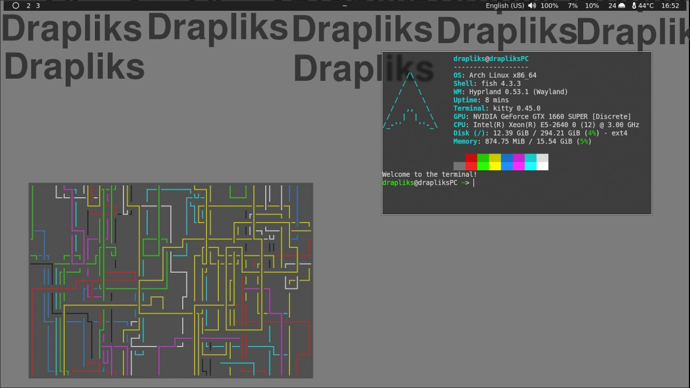
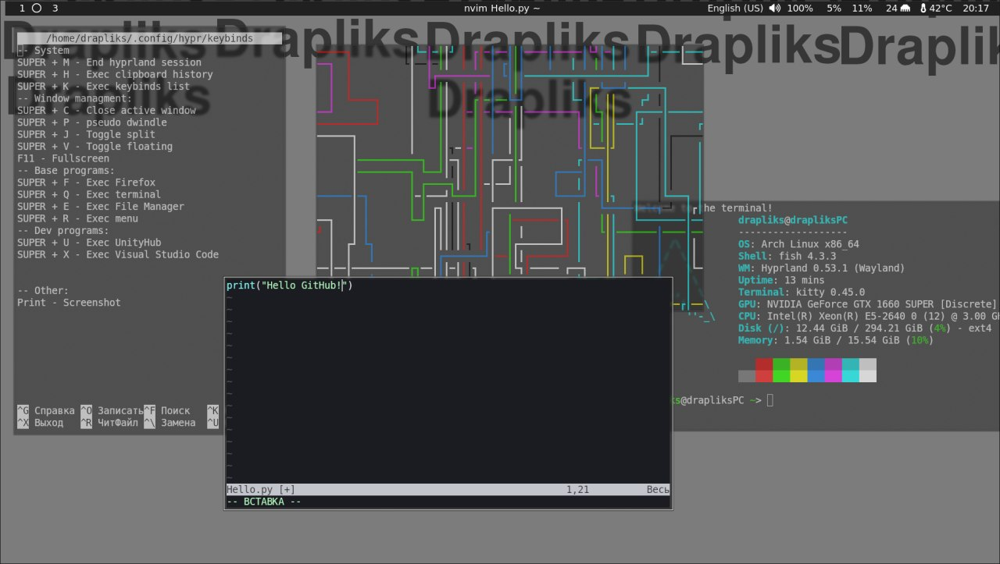

# DCHC
Drapliks Custom Hyprland Config - with beautiful design, convenient installation with all the necessary packages for Arch Linux
# Packages
Main packages:
```
nwg-look fastfetch waybar papirus-icon-theme hyprpaper mako wl-clipboard wl-clip-persist cliphist xdg-desktop-portal-hyprland grim slurp ttf-font-awesome otf-font-awesome cava obs-studio adobe-source-han-sans-jp-fonts adobe-source-han-sans-cn-fonts udiskie fish ark flatpak mpv noto-fonts-emoji pavucontrol yay qview wine yandex-music
```
Dev packages:
```
gimp dotnet-sdk unityhub visual-studio-code-bin
```
and also an optional package ```pipes.sh```

# Screenshots:



